# Лабораторная работа №6
## Система контроля версий

**Цель лабораторной работы:** изучение базовых возможностей системы управления версиями, опыт работы с Git API, опыт работы с локальным и удалённым репозиторием.

**Порядок выполнения работы:**
1. Создать аккаунт на сайте GitHub
2. Сделать копию в [https://github.com/Kurtyanik/LR6/](https://github.com/Kurtyanik/LR6/) (Fork).
3. Установить Git ([https://git-scm.com/](https://git-scm.com/)).
4. После установки настроить клиент git, введя имя пользователя (Группа Фамилия И.О.) и email.
5. Клонировать свой личный удалённый репозиторий на компьютер.
6. Добавить файл через интерфейс GitHub. Подтянуть изменения в локальный репозиторий. Работу продолжать локально.
7. Получить историю операций для каждой из веток.
8. Просмотреть последние изменения.
9. Выполнить слияние в ветку master, разрешив конфликт (можно использовать специальные редакторы или графический интерфейс git).
10. Удалить побочную ветку после успешного слияния.
11. Сделать изменения и зафиксировать их, оставляя комментарии, несколько раз.
12. Сделать откат коммита.
13. Создать ветку для отчёта.
14. Начать оформлять отчёт в файле README.md (разрешены сторонние редакторы с подсветкой синтаксиса).
15. Получить историю операций в форматированном виде (сокращённый хэш + дата + имя автора + комментарий). Добавить её в отчёт и сделать финальную фиксацию изменений.
16. Отправить локальные изменения в сетевое хранилище GitHub (если делаете работу постепенно, то синхронизацию проводить в конце рабочего сеанса).

---

## Ход выполнения работы

1. Пропускаю шаги 1,3, потому что уже имею аккаунт на GitHub.

2. Делаю форк репозитория:  
   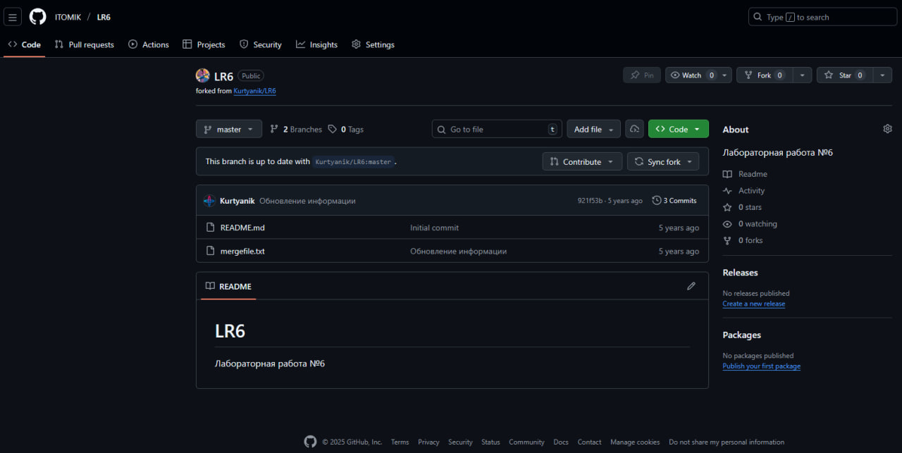

3. Клонирую репозиторий на компьютер:  
   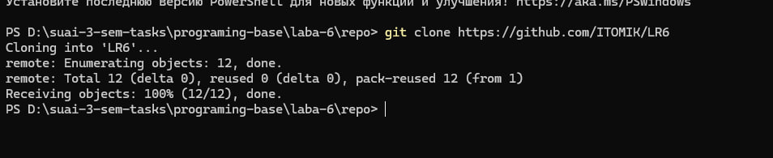  

4. Получаю информацию о ветках и смотрю последние изменения:  
   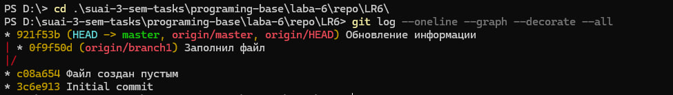

5. Начинаю мерджить ветки используя приложение Github desctop:  
   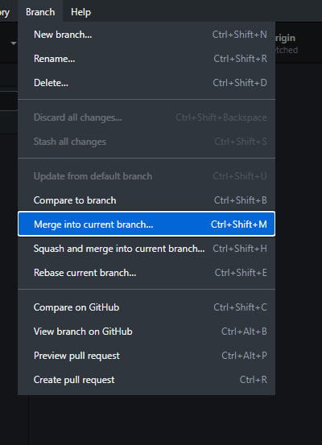  
   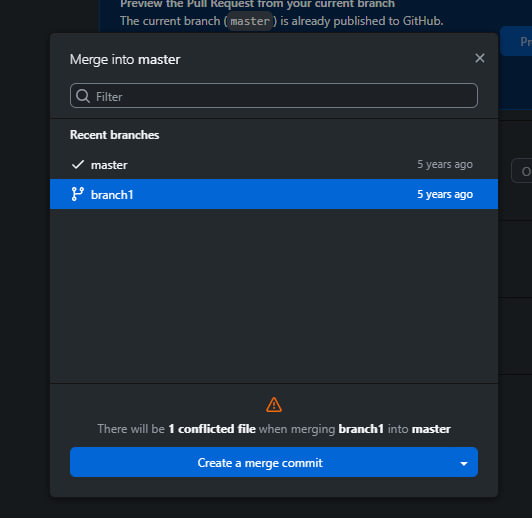  
   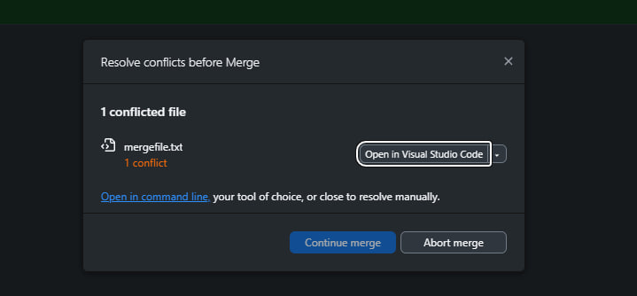
   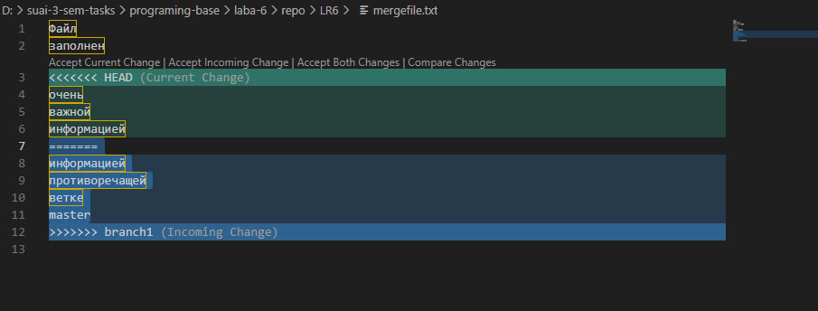

   Конфликт в том, что информация в файле `README.md` разная в различных ветках. При мердже выбираю информацию из `master`, потому что она важней (в ветке `branch1` не упоминается, что информация важная):  
   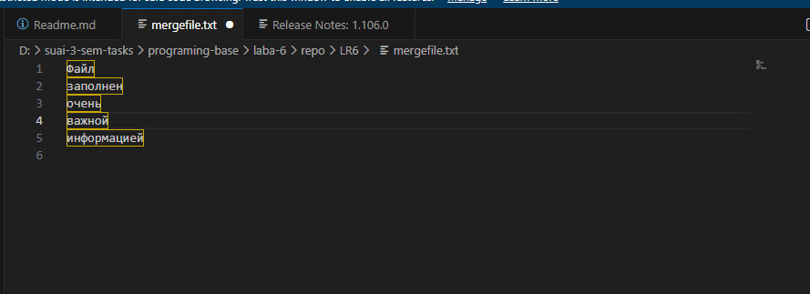

   Пушу изменения:  
   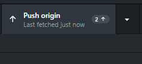

6. Удаляю ненужную ветку:  
   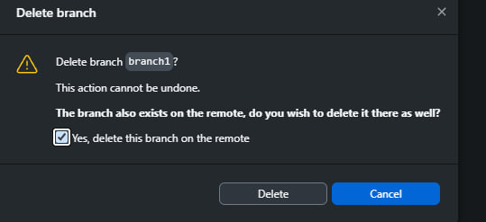

7. Делаю коммит:  
   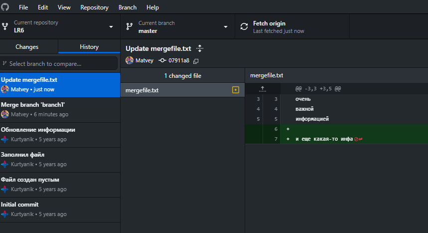  

8. Удаляю коммит:  
   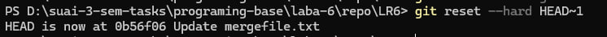

9. Создаю вектку для отчета
    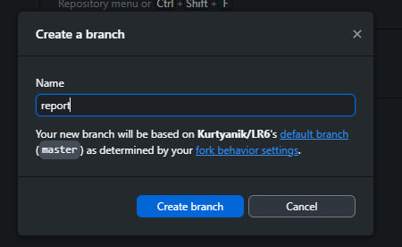

10. Создаю Readme.md
    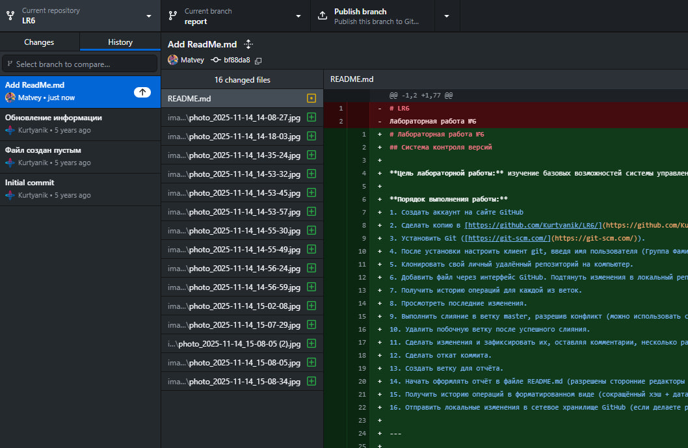

11. Выполняю команду `git log --pretty=format:"%h %cd %an %s"` и получаю данные о всех коммитах:
    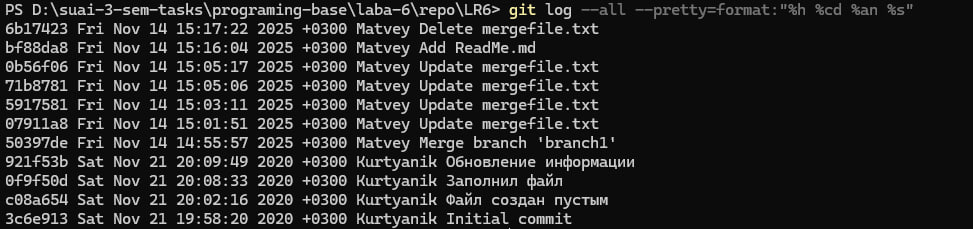